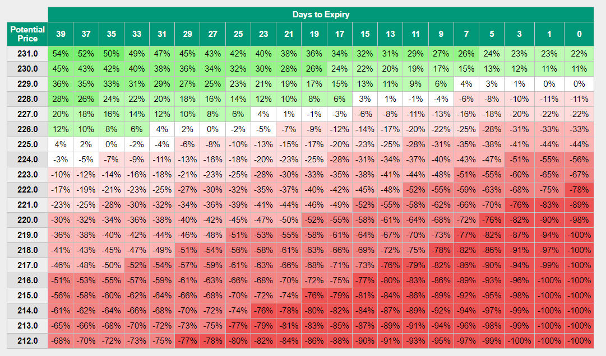
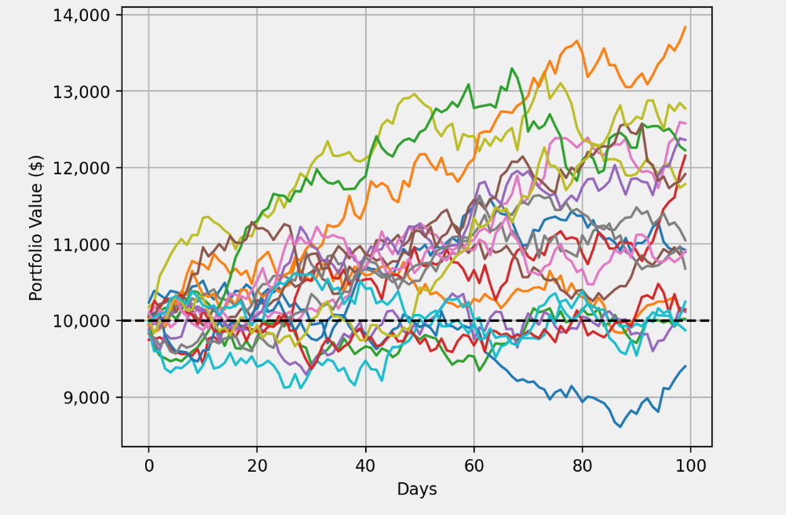

# Options Tools Web App

## Features
- Options Chain Scanner
- Options Profit Calculator
 
- Watchlist
- Bubble Charts
- Max Pain Calculator
- Monte Carlo Simulator
 
 
Register & Log in

## Stack
- Python
- Flask
- MySQL
- HTML
- HTMX
- CSS

# Getting started

## 1. Clone repo
git clone https://github.com/derekeklund/option-profit-calc.git

cd option-profit-calc
## 2. Set Up Virtual Environment
.venv\scripts\activate # Windows

source .venv/bin/activate # MacOs/Linux

## 3. Install dependencies
pip install -r requirements.txt

## 4. Run the App
flask --app flaskr run –debug
Open http://127.0.0.1:5000 in your browser

